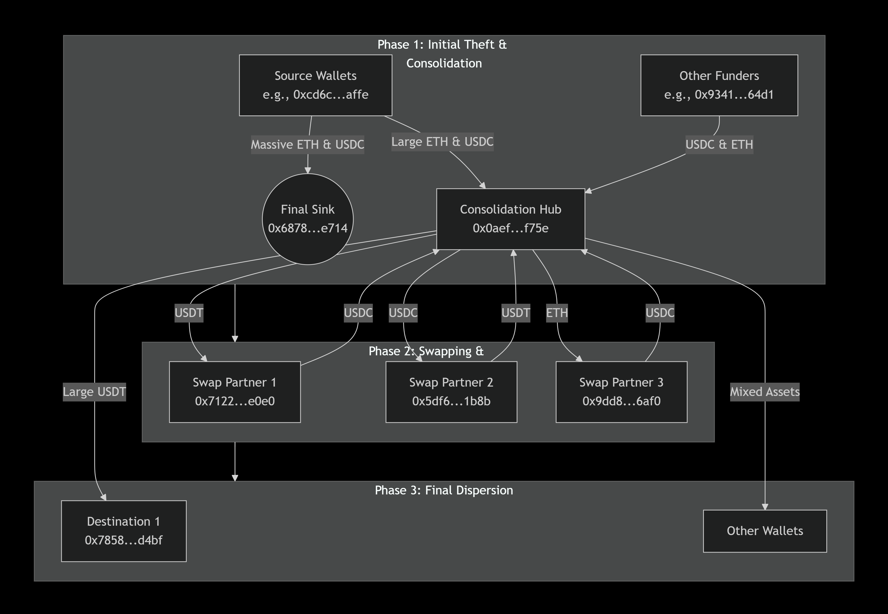
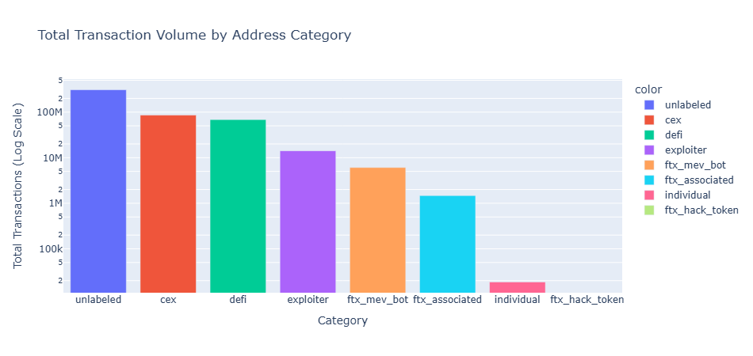
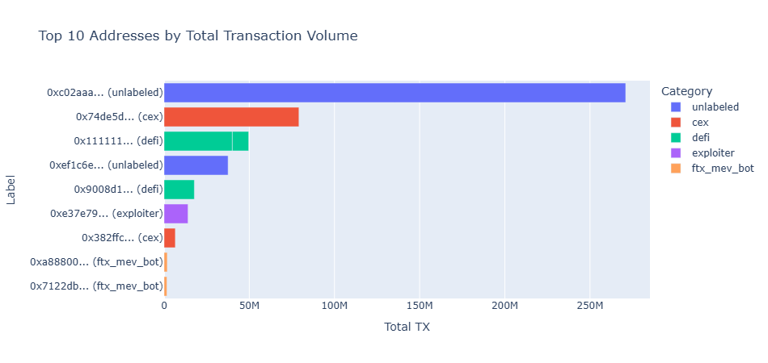

# 🧠 Crypto Hack Network Analysis

[Breadcrumbs Report Exports](https://www.breadcrumbs.app/reports/20604)

This repository contains a **Python-based forensic analysis** of blockchain wallet activity related to a cryptocurrency exploit.  
It uses **Pandas** for data cleaning and **Plotly** for interactive visualization of transactional behaviors, wallet categories, and relationships between entities (EOAs, smart contracts, and exploit-related addresses).

## Hack Network Diagram 



---

## 🧾 1. Total Transaction Volume by Address Category



Shows overall transaction flow segmented by entity type, highlighting disproportionate activity in exploit-associated wallets.

---

## 🧮 2. Smart Contract vs EOA Distribution by Category


Demonstrates which address categories rely more heavily on smart contracts versus EOAs (Externally Owned Accounts).

---

## 🔍 3. Transaction Behavior — Received vs Sent


Scatter plot visualizing incoming vs outgoing transaction counts.  
Exploit-related addresses appear as outliers, with asymmetric send/receive ratios.

---

## 💰 4. Top 10 Addresses by Total TX Volume



Highlights the most active participants in the exploit network, revealing high-frequency wallets linked to MEV bots and laundering nodes.

---

### 🧠 Research Context

This repository supports blockchain forensic efforts aimed at mapping out post-exploit fund movements.  
By categorizing and visualizing transactional behaviors, this analysis helps identify laundering strategies and CEX/DeFi bridge points used to obfuscate stolen funds.

---

👤 **Author:** [@jlucus](https://github.com/jlucus/Shuffle2025.git)


---

## 📊 Overview

This analysis investigates transaction data extracted from two CSV datasets:

- `Address.csv` — metadata about wallet addresses (names, contract flags, etc.)
- `Transactions.csv` — raw transaction-level data between addresses

The goal is to classify and visualize address behaviors to reveal:
- Patterns of exploit activity  
- Flow between exploiters, exchanges (CEX), and DeFi protocols  
- Links between individual and contract-level wallets  

---

## ⚙️ Features

The script performs the following steps:

1. **Data Loading and Cleaning**
   - Reads address and transaction data
   - Normalizes “Is Smart Contract” fields
   - Computes total transaction counts per address

2. **Categorization of Entities**
   - Classifies each address into categories such as:
     - `ftx_mev_bot`
     - `ftx_hack_token`
     - `ftx_associated`
     - `cex` (Centralized Exchanges)
     - `defi` (DeFi protocols)
     - `individual` (personal wallets)
     - `exploiter`
     - `unlabeled`
   - Categorization is rule-based using address names and flags

3. **Visual Analytics**
   - Generates four key visualizations:
     1. **Transaction Volume by Category (Bar Chart)**  
        Compares total transaction activity across wallet types.

     2. **Smart Contract vs EOA Distribution (Stacked Bar Chart)**  
        Highlights contract-heavy versus externally owned address groups.

     3. **Transaction Behavior Scatter Plot**  
        Plots `TX Received` vs `TX Sent` to reveal outliers and exploit movement.

     4. **Top 10 Addresses by Total TX Volume (Horizontal Bar Chart)**  
        Displays the most active wallets with category context.

---

## 🧩 Dependencies

Install all required packages before running the notebook or script:

```bash
pip install pandas plotly
🚀 Usage
```


```bash
git clone https://github.com/<your-username>/crypto-hack-analysis.git
cd crypto-hack-analysis
```

Place your data files in the project root:

```.csv
Address.csv
Transactions.csv
```

Run the analysis script:

```bash
python3 plot_analysis.py
Interactive charts will render directly in your browser or notebook.
```

📈 Example Output
```bash
1. Total Transaction Volume by Address Category
Log-scaled bar chart highlighting which wallet types dominate transaction flow.
```

```bash 
2. Smart Contract vs EOA Distribution
Stacked view showing contract prevalence by category.
```

```bash
3. Received vs Sent Scatter Plot
Visual correlation between incoming and outgoing activity.
```

```bash
4. Top 10 Most Active Wallets
Quick reference for high-volume participants in the exploit ecosystem.
```

```bash
🔍 Notes
The categorization logic is customizable — you can add new labels by editing the categorize_address() function.
```


Datasets can be sourced from Etherscan, Nansen, or internal blockchain forensic exports.

[Breadcrumbs Report Exports](https://www.breadcrumbs.app/reports/20604)

Plotly visualizations are interactive (zoom, hover, filter).

---

## 🧠 Research Context

This repository is part of a broader blockchain forensics effort to trace exploit-related funds through decentralized and centralized systems.

By combining data-driven labeling with visual analytics, the analysis reveals behavioral signatures of wallets involved in complex laundering and arbitrage chains.

---

### 🪪 License 

This project is released under the MIT License — free to use and modify for research, educational, or investigative purposes.
